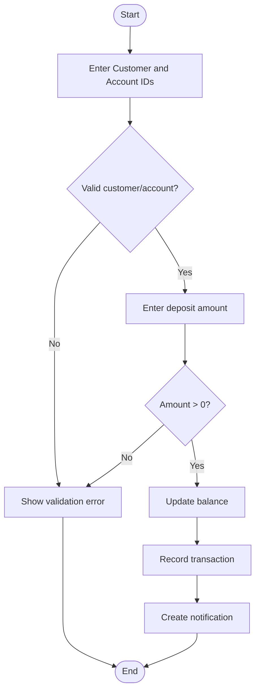
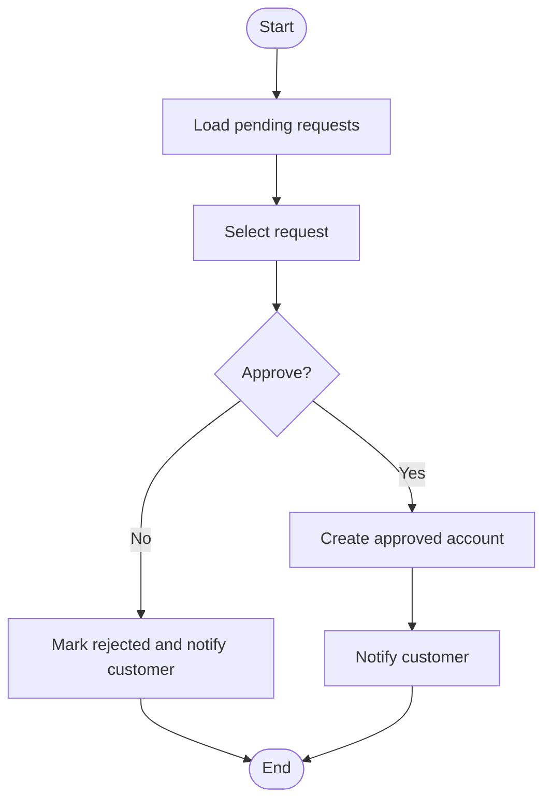

# Activity Diagrams

## Customer Deposit Flow

```mermaid
flowchart TD
    Start([Start]) --> Input[Enter Customer and Account IDs]
    Input --> Validate{Valid customer/account?}
    Validate -- No --> Error[Show validation error]
    Error --> End([End])
    Validate -- Yes --> Amount[Enter deposit amount]
    Amount --> AmountCheck{Amount > 0?}
    AmountCheck -- No --> Error
    AmountCheck -- Yes --> UpdateBalance[Update balance]
    UpdateBalance --> LogTx[Record transaction]
    LogTx --> Notify[Create notification]
    Notify --> End
```

## Manager Account Request Approval

```mermaid
flowchart TD
    Start2([Start]) --> Pending[Load pending requests]
    Pending --> Select[Select request]
    Select --> Decision{Approve?}
    Decision -- No --> Reject[Mark rejected and notify customer]
    Decision -- Yes --> CreateAccount[Create approved account]
    CreateAccount --> Notify2[Notify customer]
    Reject --> End2([End])
    Notify2 --> End2
```
