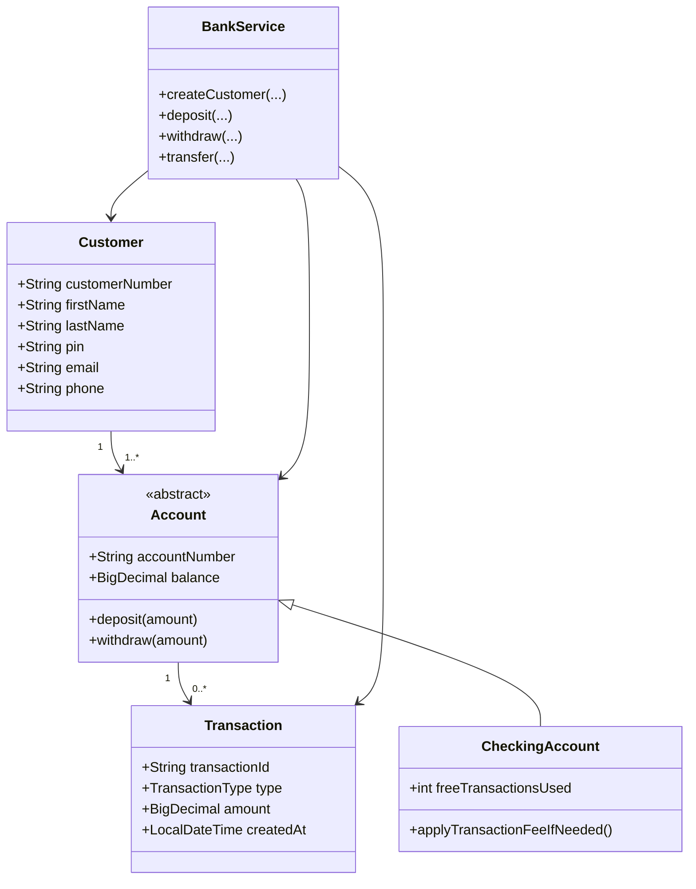

# Class Diagram

```mermaid
classDiagram
    class Customer {
      +String customerNumber
      +String firstName
      +String lastName
      +String pin
      +String email
      +String phone
    }

    class Account {
      <<abstract>>
      +String accountNumber
      +BigDecimal balance
      +deposit(amount)
      +withdraw(amount)
    }

    class CheckingAccount {
      +int freeTransactionsUsed
      +applyTransactionFeeIfNeeded()
    }

    class Transaction {
      +String transactionId
      +TransactionType type
      +BigDecimal amount
      +LocalDateTime createdAt
    }

    class BankService {
      +createCustomer(...)
      +deposit(...)
      +withdraw(...)
      +transfer(...)
    }

    Customer "1" --> "1..*" Account
    Account "1" --> "0..*" Transaction
    Account <|-- CheckingAccount
    BankService --> Customer
    BankService --> Account
    BankService --> Transaction
```
