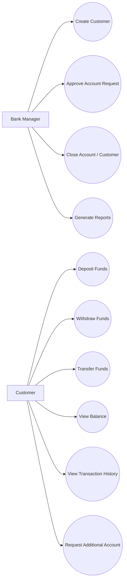

# Use Case Diagram

```mermaid
flowchart LR
    Manager[Bank Manager]
    Customer[Customer]

    CreateCustomer((Create Customer))
    ApproveRequest((Approve Account Request))
    CloseAccount((Close Account / Customer))
    GenerateReport((Generate Reports))

    Deposit((Deposit Funds))
    Withdraw((Withdraw Funds))
    Transfer((Transfer Funds))
    ViewBalance((View Balance))
    ViewHistory((View Transaction History))
    RequestAccount((Request Additional Account))

    Manager --> CreateCustomer
    Manager --> ApproveRequest
    Manager --> CloseAccount
    Manager --> GenerateReport

    Customer --> Deposit
    Customer --> Withdraw
    Customer --> Transfer
    Customer --> ViewBalance
    Customer --> ViewHistory
    Customer --> RequestAccount
```
